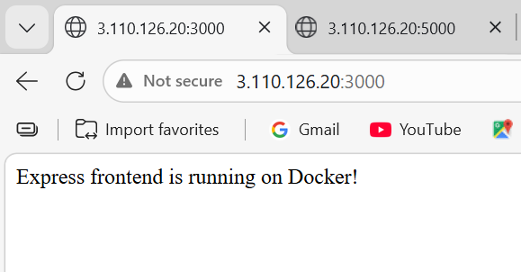
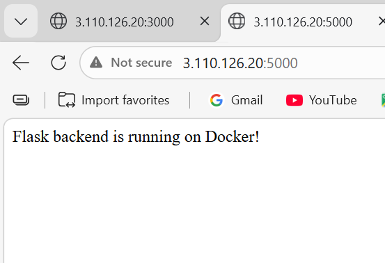

# Tutedude Project

This repository contains the backend and frontend code for the Tutedude project deployed on AWS ECS.

## Deployment URLs

- **Frontend:** http://3.110.126.20:3000
- **Backend:** http://3.110.126.20:5000
- 
## Screenshots

### Frontend

### Backend

## Project Structure

- backend/
  - app.py
  - dockerfile
  - requirements.txt
- frontend/
  - dockerfile
  - index.js
  - package.json

## Notes

- Backend: Flask app, port 5000  
- Frontend: Express app, port 3000  
- Docker images stored in AWS ECR  
- ECS Fargate launch type used
